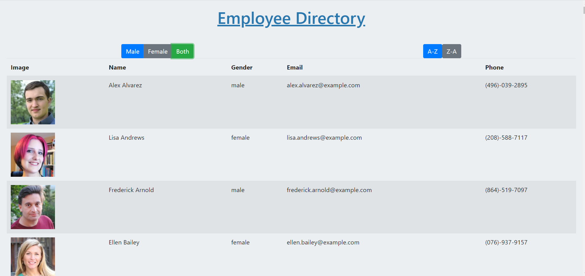

# React: Employee Directory

## Description
This application uses React to create an employee directory with the ability to sort by name and filter by gender. The app uses an API for its' data, breaks up UI into components, manages state and responds to user events. 

## Table of Contents

* [Installation](#installation)
* [Usage](#usage)
* [License](#license)
* [Badges](#badges)
* [Contributing](#contributing)
* [Tests](#tests)
* [Questions](#questions)

## Installation
To begin installation, create a GitHub repository and clone it to your code editor. Run npx create-react-app (app name) to create the React application. Cd into the application and npm start to run the application. Install the required dependencies per package.json or run npm install from command line.  

## Usage
A user can view the directory of people, sort the information by name either ascending or descending, and filter by gender. 

## License
N/A

## Badges
N/A

## Contributing 
Feel free to contact me using the information in the Questions section.

## Tests
N/A

## Questions?
[jpanakkal22](https://github.com/jpanakkal22)

You can also contact me at josh_panakkal3122@hotmail.com

Heroku : 
